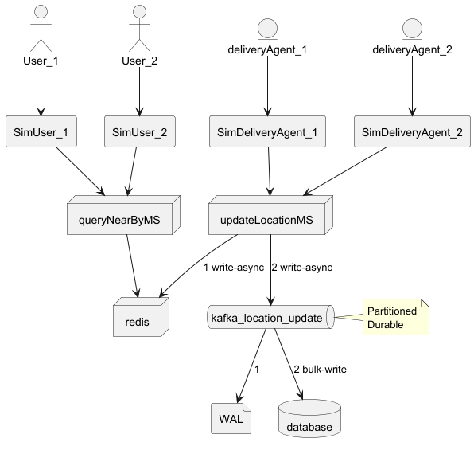

Introduction
------------

```geojson
{
  "type": "FeatureCollection",
  "features": [
    {
      "type": "Feature",
      "id": 1,
      "properties": {
        "ID": 0
      },
      "geometry": {
        "type": "Polygon",
        "coordinates": [
          [
              [-74.3,40.55],
              [-74.3,40.15],
              [-74.8,40.15],
              [-74.8,40.55],
              [-74.3,40.55]
          ]
        ]
      }
    }
  ]
}
```

Setup
-----
Run redis

<details>
<summary>docker-compose.yml</summary>
```bash
<br>version: '3.8'
<br>services:
<br>  redis:
<br>    image: redis
<br>    ports:
<br>      - "6379:6379"
<br>    command: redis-server --protected-mode no
```
</details>


Run redis-cli

Run main.py

**SimDeliveryAgent**: Simulates movements of a delivery agent who updates its location via updateLocationMS/Redis. 
Because class **SimDeliveryAgent** extends from threading.Thread, each instance has its own thread. 

**SimUser**: Simulates movements of a rider who also checks for nearby delivery agents (queryNearbyMS). 
Because class **SimUser** extends from threading.Thread, each instance has its own thread. 


Figure 1: High Level Diagram

[Redis GEOSEARCH](https://redis.io/docs/latest/commands/geosearch/) comes with two flavours that impact how the system handle location of entities.
GEOSEARCH can use given location (longitude,latitude) and radius. Beyond the given coordinates, there is nothing shared with Redis. 
GEOSEARCH can use member identifier and radius. Because Redis stores the location of given member, it can translate the request to the above GEOSEARCH. 
In this case, system needs to share the location of user entities. This increases the number of update location requests. 
This implementation decision also requires verification with legal department due to data protection regulations and laws.

[Redis GEOADD](https://redis.io/docs/latest/commands/geoadd/) adds/updates the **last location** of an entity, (lon,lat,member_id). 
For the details of Redis geohashing implementation (52 bits) see [Redis GEOADD](https://redis.io/docs/latest/commands/geoadd/) 
and [Sorted Set](https://redis.io/docs/latest/develop/data-types/sorted-sets/).

Verify
------
Program simulates the motion of multiple vehicles.
Occasional nearby queries list the delivery agents within the given radius.

<details>
<summary>Sample simulation log</summary>
[23:50:52] Step 3 of deliveryAgent-0 → Pos=(37.78775,-122.40731) 
<br>[23:50:52] Step 3 of deliveryAgent-1 → Pos=(37.78848,-122.40757) 
<br>[23:50:52] Step 3 of deliveryAgent-2 → Pos=(37.78757,-122.40685) 
<br>[23:51:02] Step 2 of user-0 → Pos=(37.78790,-122.40742,447.46) Nearby=[b'deliveryAgent-0', b'deliveryAgent-2', b'deliveryAgent-1']
<br>[23:51:02] Step 2 of user-1 → Pos=(37.78792,-122.40750,64.63) Nearby=[b'deliveryAgent-0', b'deliveryAgent-1']
<br>[23:51:02] Step 4 of deliveryAgent-1 → Pos=(37.78858,-122.40737) 
<br>[23:51:02] Step 4 of deliveryAgent-2 → Pos=(37.78750,-122.40680) 
<br>[23:51:02] Step 4 of deliveryAgent-0 → Pos=(37.78762,-122.40756) 
<br>[23:51:12] Step 5 of deliveryAgent-2 → Pos=(37.78769,-122.40678) 
<br>[23:51:12] Step 5 of deliveryAgent-1 → Pos=(37.78851,-122.40748) 
<br>[23:51:12] Step 5 of deliveryAgent-0 → Pos=(37.78773,-122.40749)
</details>


How to connect to Redis by redis-cli?
--
```bash
  redis-cli -h 127.0.0.1 -p 6379
```

<details>
<summary>Helpful redis-cli commands</summary>
<verbatim>
> KEYS d* <br>
> ZRANGE drivers 0 -1 <br>
> GEOPOS drivers deliveryAgent-0 <br>
> GEOPOS drivers deliveryAgent-1 <br>
> GEOPOS drivers deliveryAgent-2 <br>
> GEOHASH drivers deliveryAgent-0 <br>
> GEOHASH drivers deliveryAgent-1 <br>
> GEOHASH drivers deliveryAgent-2 <br>
> GEOSEARCH drivers FROM LONLAT -122.4 37.8 BYRADIUS 5000 M
<br>> GEOSEARCH drivers FROM LONLAT -122.4 37.8 BYRADIUS 5000 M WITHDIST WITHHASH WITHCOORD
<br>> GEOSEARCH drivers FROMMEMBER User-1 BYRADIUS 5000 M WITHDIST WITHHASH WITHCOORD
</verbatim>
</details>

How to connect to Redis by Redis Insight?
- 
RedisInsight : http://localhost:5540

References
----------
1. [Redis GEOSEARCH](https://redis.io/docs/latest/commands/geosearch/)
1. [Redis Sorted Set](https://redis.io/docs/latest/develop/data-types/sorted-sets/)
1. [Redis GEOADD](https://redis.io/docs/latest/commands/geoadd/)
1. https://crashedmind.github.io/PlantUMLHitchhikersGuide/layout/layout.html
